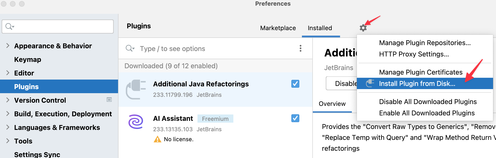

# Forked Presentation Assistant Plugin

This is a forked copy of the Presentation Assistant plugin that has been modified to work with IntelliJ IDEA versions 2023.3 through 2024.1. 

## Why?

I don't like the built-in version, for various reasons, and so far it doesn't look like JetBrains is interested in changing it.

## What's Changed?

I only modified the name (to make it clear it was a fork of the original) and, of course, the versions of IntelliJ IDEA that it's compatible with.

## Installation

I don't want to go through the plugin approval process (since I'm not even sure it'd be approved), so you'll have to install it from disk. Go to the Preferences dialog, click on Plugins, then click the gear icon and select `Install Plugin from Disk...` and select the zip file found in this repository.

----

## Original README

['Presentation Assistant' plugin](http://plugins.jetbrains.com/plugin/7345) for IntelliJ IDEs up to version 2023.2:

Since 2023.3, functionality of the plugin is included in IntelliJ Platform, and its source now resides in [intellij-community](https://github.com/JetBrains/intellij-community/tree/master/platform/platform-impl/src/com/intellij/platform/ide/impl/presentationAssistant).
This repository won't be updated anymore.
